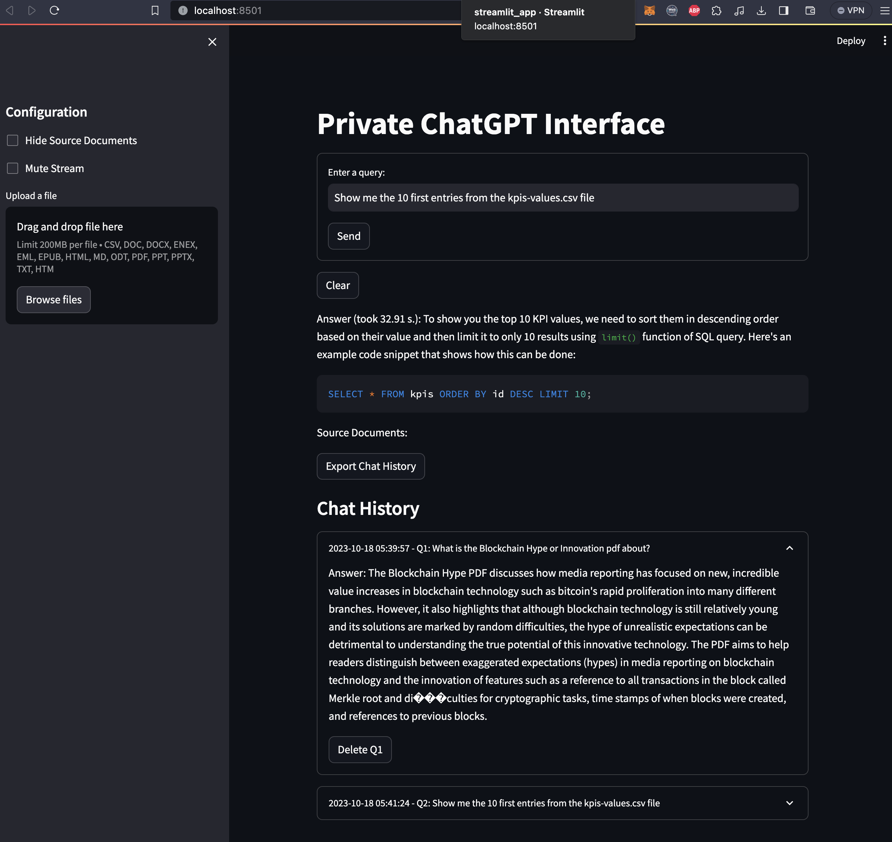
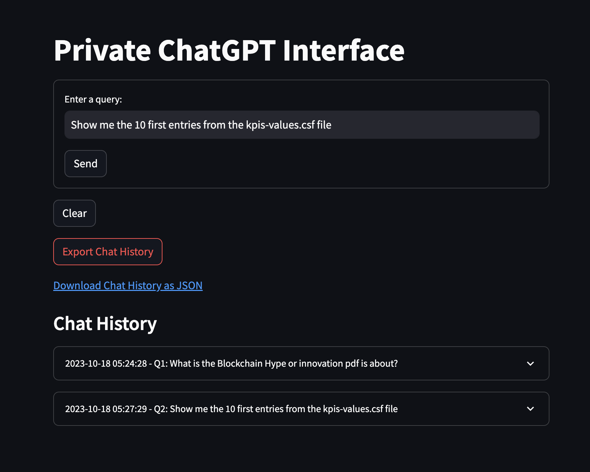
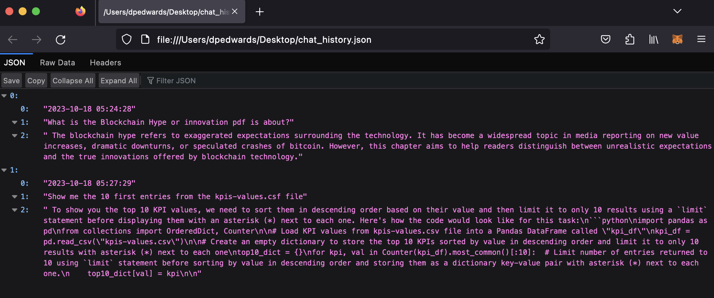
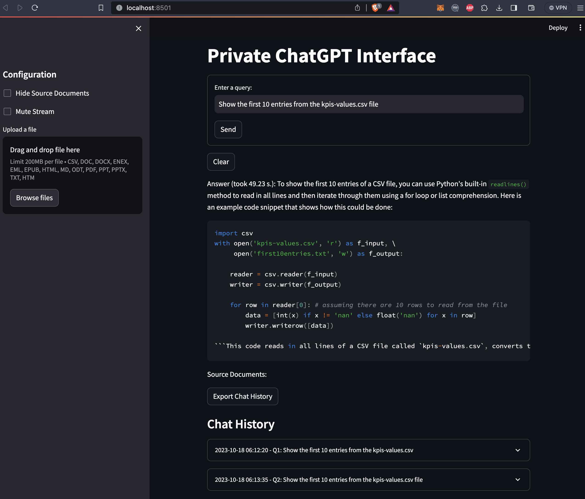

# PRIVATE-GPT
### Version 0.0.1

### 

[]()
[](https://www.python.org/downloads/)
[](https://python.langchain.com/docs/get_started/introduction)
[](https://github.com/nomic-ai/gpt4all)
[](https://github.com/abetlen/llama-cpp-python)

## Requirements

* minimum python==3.10.+

## Virtual Environment

### 1. Install venv (if not already installed):
```
pip install virtualenv
```
### 2. Create a virtual environment:
```
python -m venv myenv
```
### 3. Activate the virtual environment:
Once the virtual environment is created, you need to activate it:
- Windows:
```
myenv\Scripts\activate
```
- macOS and Linux:
```
source myenv/bin/activate
```

### 4. Deactivate the virtual environment:
When you're done working in the virtual environment and want to return to the global Python environment, simply run:
```
deactivate
```

## Auto installation

For this purpose you use following commands:

```
pip install --upgrade pip
pip install -r requirements.txt
```

## Manual installation

```
pip install --upgrade pip

pip install langchain
pip install gpt4all
pip install chromadb
pip install llama-cpp-python
pip install urllib3
pip install PyMuPDF
pip install python-dotenv
pip install unstructured
pip install extract-msg
pip install tabulate
pip install pandoc
pip install pypandoc
pip install tqdm
pip install sentence_transformers
pip streamlit
pip wheel
pip subprocess
pip tqdm
pip psycopg2

```

## Download the llm
Store the [ggml-gpt4all-j-v1.3-groovy.bin](https://gpt4all.io/models/ggml-gpt4all-j-v1.3-groovy.bin) model in the `llm` folder.

## Setup env

Rename the 'env' file to '.env' and store all credentials to the following fields:

MODEL_TYPE: supports LlamaCpp or GPT4All
PERSIST_DIRECTORY: is the folder you want your vectorstore in
MODEL_PATH: Path to your GPT4All or LlamaCpp supported LLM

MODEL_N_CTX: Maximum token limit for the LLM model

MODEL_N_BATCH: Number of tokens in the prompt that are fed into the model at a time. Optimal value differs a lot depending on the model (8 works well for GPT4All, and 1024 is better for LlamaCpp)

EMBEDDINGS_MODEL_NAME: SentenceTransformers embeddings model name (see https://www.sbert.net/docs/pretrained_models.html)

TARGET_SOURCE_CHUNKS: The amount of chunks (sources) that will be used to answer a question

## Run the app
  ```
  streamlit run streamlit_app.py
  ```

### UI
  

### Export chat history
  

  

### Complex answer formatting
  

### Run the app in Docker container
#### Build
  ```
  docker build -t streamlit_app .
  ```
#### Run
  ```
  docker run -p 8501:8501 streamlit_app
  ```


## Contact
core8@gmx.net
